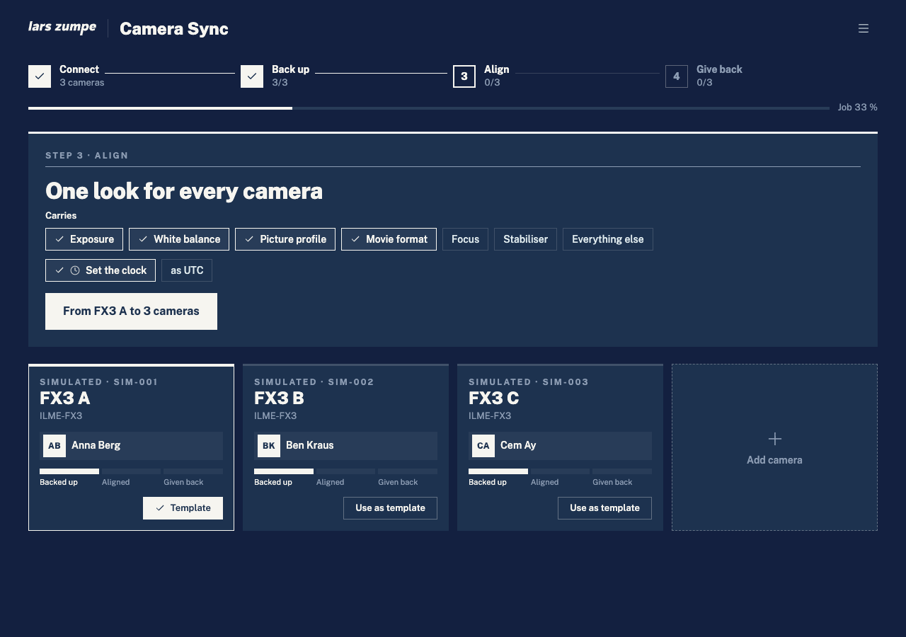
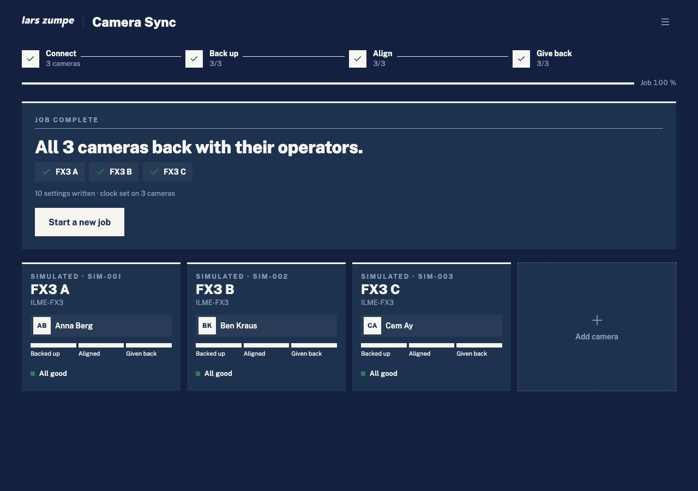
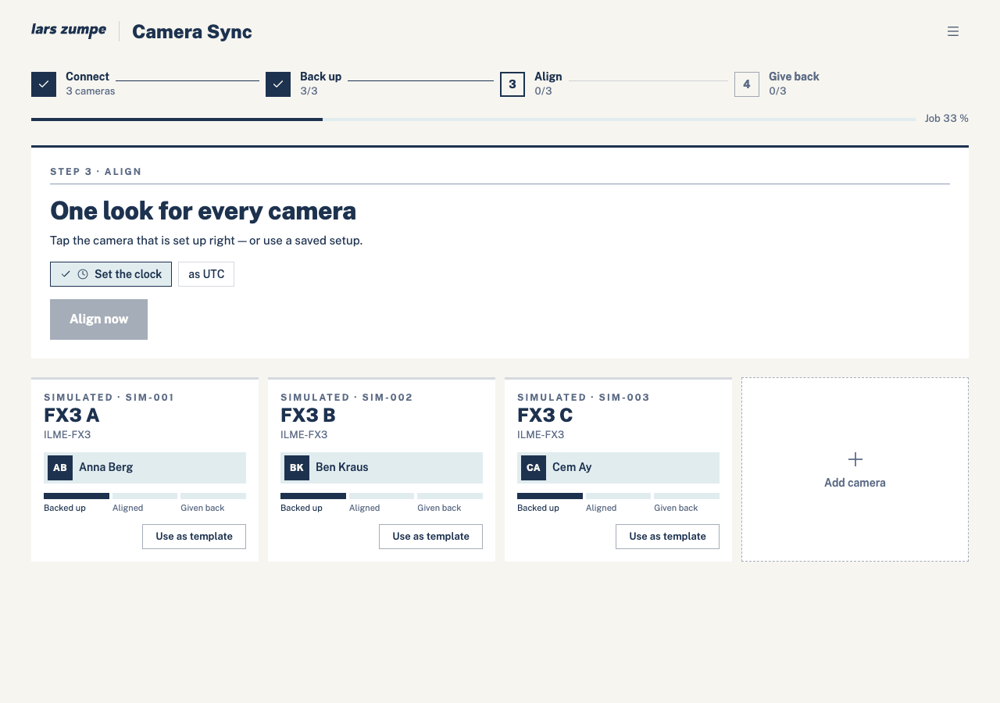
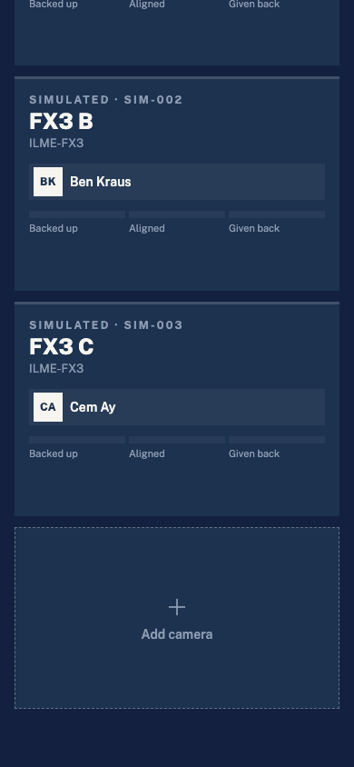
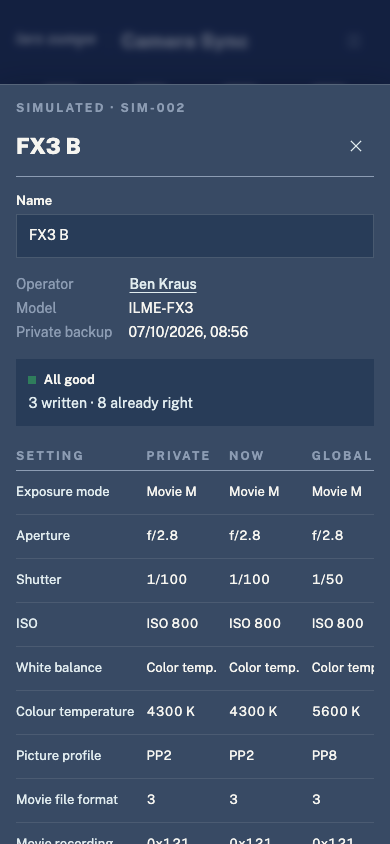

<p align="center">
  <picture>
    <source media="(prefers-color-scheme: dark)" srcset="docs/brand/lzm_hauptlogo_offwhite.svg" />
    
  </picture>
</p>

<h1 align="center">LZ Camera Sync</h1>

<p align="center">
  <b>One setup for every camera on the job — and each camera back to its owner afterwards.</b><br />
  Back up, align and restore the settings of several Sony cameras, starting with the FX3.
</p>

<p align="center">
  <a href="https://github.com/larszu/lz-camera-sync/releases/latest">
    
  </a>
</p>

<p align="center">
  
</p>

---

## A job in four steps

The app always shows one next step and one big button for it. A track at the
top counts every camera through the job; each camera tile fills three
checkpoints — *backed up*, *aligned*, *given back*.

| Step | What you do | What happens |
| --- | --- | --- |
| **1 · Connect** | Plug the cameras in over USB, or connect over Wi-Fi | Each body appears as a tile, named FX3 A, FX3 B … |
| **2 · Back up** | *Back up now* | Every camera is read completely and stored under its serial number — the way its operator set it up |
| **3 · Align** | Tap *Use as template* on the camera that is set up right, pick what carries over, *From FX3 A to 3 cameras* | The template's settings and the current time go to every camera; each one is read back and checked |
| **4 · Give back** | *Give back now* | Every camera gets its own backup back |

Then *Start a new job*. A camera that joins mid-job starts at step 1 on its
own; a camera that already carries the global setup is never backed up again,
so its private backup cannot be overwritten.

No camera at hand? *Try it with 3 simulated cameras* on the first screen runs
the whole job against simulated FX3 bodies — in the app and in the browser.

<table>
  <tr>
    <td width="50%" align="center"><br /><b>Job complete</b></td>
    <td width="50%" align="center"><br /><b>Light appearance</b></td>
  </tr>
  <tr>
    <td width="50%" align="center"><br /><b>Phone</b></td>
    <td width="50%" align="center"><br /><b>Camera sheet: private · now · global</b></td>
  </tr>
</table>

## Why LZ Camera Sync

- **Cameras belong to people.** Tap the square on a tile and pick the
  operator, or type a new name; the backup stays with the camera's serial.
- **Everything is backed up, not just what the app knows.** The camera hands
  over every setting with its current value and allowed values in one call;
  each one it reports as writable goes into the backup.
- **Checked, not hoped.** After every write the camera is read back. Values it
  did not take, or does not offer, are named on the tile and in the camera
  sheet, which lists *private · now · global* per setting.
- **Lenses stay put.** Zoom and focus positions are never written, so a camera
  on a rig does not move when it is given back.
- **No Sony SDK.** Speaks PTP with Sony's vendor extension directly — the same
  path the [LZ Camera Bridge](https://github.com/larszu/lz-camera-bridge) uses
  for the FX3. One TypeScript core runs on desktop and phone.
- **Offline.** All data stays on the device and exports as one JSON file;
  the typeface ships with the app, nothing loads from the web.
- **Light and dark.** Follows the system, or set it in the menu.

## Platforms

| | USB | Wi-Fi (PTP/IP) | Download |
| --- | --- | --- | --- |
| **macOS** | ✓ libusb | ✓ | `.dmg` (Apple Silicon, Intel) |
| **Windows** | ✓ libusb, WinUSB driver needed | ✓ | Installer, portable `.exe` |
| **Linux** | ✓ libusb | ✓ | `.AppImage` |
| **Android** | native plugin in progress | native plugin in progress | `.apk` |
| **iOS** | no raw USB on iOS | native plugin in progress | — (needs an Apple developer account) |

The Android build runs the full interface with simulated cameras today; the
native camera plugins are tracked in [#5](https://github.com/larszu/lz-camera-sync/issues/5)
and [#6](https://github.com/larszu/lz-camera-sync/issues/6). Details in
[docs/mobile.md](docs/mobile.md).

## Not yet verified on a camera

Marked honestly until an FX3 has been on the desk ([#3](https://github.com/larszu/lz-camera-sync/issues/3)):

- **Clock.** Data type of `DateTimeSet` (0xD223) and whether the FX3 expects
  local time or UTC (switch *send as UTC*). The camera's date menu must be
  closed while it is set.
- **Wi-Fi.** Framing per CIPA DC-005 / libgphoto2; the access authentication
  newer Sony bodies require is not implemented yet ([#7](https://github.com/larszu/lz-camera-sync/issues/7)).
- **Mode-locked values.** A body backed up in P/A/S does not report its manual
  shutter as writable, so that value is not in the backup ([#4](https://github.com/larszu/lz-camera-sync/issues/4)).

The whole flow is tested against simulated FX3 bodies, including the USB
framing byte for byte: `npm test`.

## Prepare the camera (FX3, USB)

Menu → Network → *PC Remote* on, USB connection *PC Remote*. On Windows libusb
needs a WinUSB driver for the camera (e.g. with Zadig), which replaces Sony's
own driver for that device. On macOS `ptpcamerad` may hold the camera; run
`killall ptpcamerad` before connecting.

## How it talks to the camera

| Step | PTP operation |
| --- | --- |
| Session | `OpenSession`, Sony SDIO handshake (protocol 3.00) |
| Back up | `GetAllExtDevicePropInfo` 0x9209 — every property, value, type, allowed values |
| Write | `SetExtDevicePropValue` 0x9205, exposure mode and movie format first, failures retried once after a fresh read |
| Clock | `DateTimeSet` 0xD223, 64-bit Unix time as documented in Sony's Camera Remote SDK |
| Never written | buttons (0xD2C0–0xD2FF), zoom and focus positions |

Opcodes and data layout follow libgphoto2. All protocol code lives in
`src/core` (plain TypeScript, no Node APIs); a platform only provides byte
pipes — USB bulk and TCP — through `window.lzHost` ([electron/ptp-host.d.ts](electron/ptp-host.d.ts)).

## Build from source

Requires [Node.js](https://nodejs.org/) 22+.

```bash
npm install
npm run dev            # browser, http://localhost:4192 (simulator only)
npm run electron:dev   # desktop app with USB and Wi-Fi
npm test               # core tests
npm run dist:mac       # or dist:win
```

Releases are built by [`.github/workflows/release.yml`](.github/workflows/release.yml)
for macOS, Windows, Linux and Android when a `v*` tag is pushed.

Built with Electron, Capacitor, React 19, TypeScript, Vite and Lucide icons.

## Licence

Source available, not open source. Free to use the released builds, including
commercially; no redistribution or derivative works without written consent.
See [LICENSE](LICENSE).
